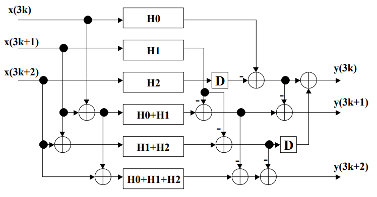

# AVLSI FIR Filter Design Project
## Objective
The objective of this course project is to design and implement:
1. Low-pass FIR filter
2. Use 100-taps or more 
    * 102 used 
3. The transition region of 0.2pi~0.23pi rad/sample and stopband attenuation of at least 80dB
4. Decide the quantization of filter coefficients and input/output/intermediate data on your own 
    * 32 bit coeffs used
5. The design entry can be either Verilog or VHDL, though Verilog is preferred due to its popularity in the industry. 
    * SystemVerilog used
6. You may use Xilinx/Altera FPGA design environment or Synopsys Design Compiler.
    * Xilinx Vivado used
7. produce the following filters:
    * (1) pipelined, 
    * (2) reduced-complexity parallel processing (L=2 and L=3) 
    * (3) combined pipelining and L=3 parallel processing


## Matlab Implementation 
I'll begin by creating the 32 bit filter coefficients. This can be done using Matlab's Filter Designer Tool. this can be accessed by typing `filterDesigner` into the Matlab Terminal as shown in Figure 1. Figure 2 shows off the designed filter.

<div align="center">
  
  <br>
  <p>Figure 1: Accessing Matlab Filter Designer</p>
</div>

<div align="center">
  
  <br>
  <p>Figure 2: Complete filter meeting our design spec </p>
</div>

## Filter Coefficients Quantization 
Notice the Quantized waveform and the Reference waveform in Figure 2. The two are laying on top of each other indicating a high degree of quantization. This leads us to the first major question we need to ask: how large should the filter coeffs be: 8, 16, 24, 32, 64 bits? We should keep the number of bits to a minimum as that will reduce the computation time, however, if we make the number of bits too small then the filter will be ineffective. A more systematic approach more than likely exists, however I chose to take an experimental approach. To accomplish this I developed `AVLSI_filter.m`, a program that implements a Parks-McClellan algorithm to create an FIR filter, and displays the Ideal vs Quantized results. The results below show off the response from 16, 24 and 32 bit quantization. 

<div align="center">
  
  <br>
  <p>Figure 3: 16 bit Quant vs Ideal </p>
</div>

<div align="center">
  
  <br>
  <p>Figure 4: 24 bit Quant vs Ideal </p>
</div>

<div align="center">
  
  <br>
  <p>Figure 5: 32 bit Quant vs Ideal </p>
</div>

Since the 24-bit quantization ideally matches the desired filter response with the fewest bits, I initially planned to use 24-bit quantization for my filter coefficients. However, I couldn’t get the 24-bit quantization to work properly, so I ended up using 32-bit quantization instead. I then exported the coefficients from `filterDesigner` as 32-bit signed integers in a C header file, fdacoefs.h. To convert these coefficients to their 24-bit and 32-bit signed binary equivalent (for reference or further processing), I developed a script called `dec-to-bin.py`. I'd like to update the coeffs from 32 to 24 bits in the future.

In order to generate an input to this filter, I've developed yet another python script `bin-sin.py` to produce a 16 bit sin wave at an increasing frequency: 500Hz to 41.4kHz. , I will assume that it is fair game to arbitrarily choose the sampling frequency for this. In design of the basic filter, the sampling frequency is not super important. It does not affect the coefficients for the filter itself assuming we preserve the same general transition region across all normalized frequencies. However, for implementing and testing the filter later, I'll choose a sampling rate of 44.1 kHz. If you are using a different sampling rate, you will need to produce a new file using `bin-sin.py`. 

Now that we have our sin wave input, filter coeffs, and Matlab theory, we can start building the first filter.

## Filter Implementation

I'll discuss the results of my Filter Implementations in the following order for each filter:
1. High-Level Design
2. Simulation Output
3. RTL Schematic
4. Critical Path / Timing
5. Power Usage 
6. Compute Resource Usage / Silicon Area Usage

## Pipelined FIR Filter
### High Level Design:

<div align="center">
  
  <br>
  <p>Figure 6: Pipelined FIR Filter Block Diagram </p>
</div>

To design the pipelined filter, I simply added delay blocks onto each stage of the accumulator line of the filter [1]. This optimization reduced the critical path to the time of one adder plus time of one multiplier. For this to work, delay blocks must also be added onto the delay line, essentially doubling the delay of each step.

### Simulation Output:

<div align="center">
  
  <br>
  <p>Figure 7: Pipelined FIR Filter Simulation Output </p>
</div>

Figure 7 confirms the functionality of the filter. As shown below in Figure 7, we see the same oscillation in the pass band as in the MATLAB filter. Then, we see a sharp cutoff region as the logarithmically increasing frequency of x_in becomes too high. The sim take 200ms to complete. To get a proper wavefrom view set "Radix" to "Signed Decimal" and "Waveform Style" to "Analog".

<div align="center">
  
  <br>
  <p>Figure 8: Pipelined FIR Filter 24-bit Coeff  </p>
</div>

For posterities' sake I include the 24 bit coeff output. The two sims are quite different and the 32 bit sim looks far closer to my expectations. I've included the two filter coefficient files for the reader to examine.

### RTL Schematic:

<div align="center">
  
  <br>
  <p>Figure 9: Pipelined FIR Filter Schematic  </p>
</div>

Shown here is the first portion of the RTL Schematic of the Pipelined FIR Filter. I'll only show the beginning of each filter since the design is a repeating pattern. As you can see, the schematic displays a structure similar to the block diagram found in Figure 6, meaning we have produced the correct circuit topology.

### Critical Path / Timing:

To obtain the timing report data:
- synthesize the design
- run `report_timing -delay_type max -path_type full` in the TCL terminal 

```
Copyright 1986-2022 Xilinx, Inc. All Rights Reserved. Copyright 2022-2024 Advanced Micro Devices, Inc. All Rights Reserved.
--------------------------------------------------------------------------------------------------------------------------------------------------
| Tool Version      : Vivado v.2024.2 (win64) Build 5239630 Fri Nov 08 22:35:27 MST 2024
| Date              : Mon Apr  7 13:18:21 2025
| Host              : LAPTOP-QHLAT4H1 running 64-bit major release  (build 9200)
| Command           : report_timing -delay_type max -path_type full
| Design            : fir_pipelined
| Device            : xczu5ev-sfve784
| Speed File        : -1LV  PRODUCTION 1.30 05-15-2022
| Design State      : Synthesized
| Temperature Grade : I
--------------------------------------------------------------------------------------------------------------------------------------------------

Timing Report:

Slack (MET) :             22667.029ns  (required time - arrival time)
  Source:                 accumulator_pipeline_reg[101]/DSP_OUTPUT_INST/CLK
                            (rising edge-triggered cell DSP_OUTPUT clocked by clk  {rise@0.000ns fall@11338.000ns period=22676.000ns})
  Destination:            y_out[8]
                            (output port clocked by clk  {rise@0.000ns fall@11338.000ns period=22676.000ns})
  Path Group:             clk
  Path Type:              Max at Slow Process Corner
  Requirement:            22676.000ns  (clk rise@22676.000ns - clk rise@0.000ns)
  Data Path Delay:        2.435ns  (logic 1.359ns (55.815%)  route 1.076ns (44.185%))
  Logic Levels:           1  (OBUF=1)
  Output Delay:           3.000ns
  Clock Path Skew:        -3.502ns (DCD - SCD + CPR)
    Destination Clock Delay (DCD):    0.000ns = ( 22676.000 - 22676.000 ) 
    Source Clock Delay      (SCD):    3.502ns
    Clock Pessimism Removal (CPR):    0.000ns
  Clock Uncertainty:      0.035ns  ((TSJ^2 + TIJ^2)^1/2 + DJ) / 2 + PE
    Total System Jitter     (TSJ):    0.071ns
    Total Input Jitter      (TIJ):    0.000ns
    Discrete Jitter          (DJ):    0.000ns
    Phase Error              (PE):    0.000ns

    Location             Delay type                Incr(ns)  Path(ns)    Netlist Resource(s)
  -------------------------------------------------------------------    -------------------
                         (clock clk rise edge)        0.000     0.000 r  
                         propagated clock network latency
                                                      3.502     3.502    
                         DSP_OUTPUT                   0.000     3.502 r  accumulator_pipeline_reg[101]/DSP_OUTPUT_INST/CLK
                         DSP_OUTPUT (Prop_DSP_OUTPUT_CLK_P[39])
                                                      0.347     3.849 r  accumulator_pipeline_reg[101]/DSP_OUTPUT_INST/P[39]
                         net (fo=1, unplaced)         1.076     4.925    y_out_OBUF[8]
                         OBUF (Prop_OBUF_I_O)         1.012     5.937 r  y_out_OBUF[8]_inst/O
                         net (fo=0)                   0.000     5.937    y_out[8]
                                                                      r  y_out[8] (OUT)
  -------------------------------------------------------------------    -------------------

                         (clock clk rise edge)    22676.000 22676.000 r  
                         propagated clock network latency
                                                      0.000 22676.000    
                         clock pessimism              0.000 22676.000    
                         clock uncertainty           -0.035 22675.965    
                         output delay                -3.000 22672.965    
  -------------------------------------------------------------------
                         required time                      22672.967    
                         arrival time                          -5.937    
  -------------------------------------------------------------------
                         slack                              22667.029    
```

We see from the timing report that our critical path time, or as Vivado calls it "Data Path Delay", is 2.435ns, where the logic tasks 1.359ns (55.815%) and the route takes 1.076ns (44.185%). It should be noted that I'm using the `XCZU5EV-SFVE784-lLV-I` device from Xilinx which can also effect the critical path times.

### Power Usage:

<div align="center">
  
  <br>
  <p>Figure 10: Pipelined FIR Filter Power Report  </p>
</div>

From our power report, we see that this implementation needs 0.328W on this fpga. The vast majority of the power usage comes from the IO. Reducing coeff length from 32 to 24 bit and reducing the resolution of the sin input from 16 bit to say 8 bit could help reduce the the IO power usage. To find this info, go to "Implementation -> Report Power"

### Compute Resource Usage / Silicon Area Usage:

<div align="center">
  
  <br>
  <p>Figure 11: Pipelined FIR Filter Util Report  </p>
</div>

<div align="center">
  
  <br>
  <p>Figure 12: Pipelined FIR Filter Place and Route  </p>
</div>

Figure 11 shows the compute utilization, aka all of the FFs, LUTs, DSPs, and IO elements that have been used in the FPGA to implement the algorithm. Figure 12 shows how these compute devices have been placed in the FPGA and how they have been routed together. All of this info can be found under "Implementation -> Usage Report".

It is very difficult to get an accurate number for the silicon area used by these compute units. The area would be dependent on many factors, such as: process node used to make the FPGA, differing circuit topologies of each compute element, etc. 

ChatGPT gives me the following highly ballpark-ish values for each:
<br>
Literature Values (approximate ranges):
  - LUT6: ~10–50 µm²
  - Flip-Flop: ~5–15 µm²
  - DSP block: ~0.1–0.5 mm²
  - I/O buffer: ~0.05–0.1 mm²

I'll assume the lowest value for each range.<br>
Therefore: A<sub>silicon</sub> = N<sub>LUT</sub> * A<sub>LUT</sub> + N<sub>FF</sub> * A<sub>FF</sub> + N<sub>DSP</sub> * A<sub>DSP</sub> + N<sub>IO</sub> * A<sub>IO</sub>

Or: A<sub>silicon</sub> = N<sub>LUT</sub> * 10µm² + N<sub>FF</sub> * 5µm²+ N<sub>DSP</sub> * 0.1µm² + N<sub>IO</sub> * 0.05µm²

A<sub>silicon</sub> = 806<sub>LUT</sub> * 10µm² + 3664<sub>FF</sub> * 5µm²+ 102<sub>DSP</sub> * 0.1µm² + 34<sub>IO</sub> * 0.05µm²

A<sub>silicon</sub> = 26391.9µm²

## L2 Parallel FIR Filter
### High Level Design:

<div align="center">
  
  <br>
  <p>Figure 13: L2 Parallel FIR Filter Block Diagram  </p>
</div>

Above is the L2 Parallel Filter's block diagram. This along with lots of theoretical understanding can be gathered from Parhi's slides[2]. I'll be making reference to this work for the rest of this report as this work is invaluable in accomplishing this project. The main challenge with this filter architecture is splitting up the coeffs: half odd going to H1 and half even going to H0.

### Simulation Output:

<div align="center">
  
  <br>
  <p>Figure 14: L2 Parallel FIR Filter Sim Output  </p>
</div>

As shown in Figure 14, the L2 filter works as desired. It takes 110ms to complete; close but not exactly a speed up of 2X when compared to the first filter. 

### RTL Schematic:

<div align="center">
  
  <br>
  <p>Figure 15: L2 Parallel FIR Filter Sim Output  </p>
</div

Shown above is one of the sub filters of the L2 Filter. As this topology resembles the first filter, I'd conclude that this filter's RTL schematic is expected. 

### Critical Path / Timing:

```
Copyright 1986-2022 Xilinx, Inc. All Rights Reserved. Copyright 2022-2024 Advanced Micro Devices, Inc. All Rights Reserved.
--------------------------------------------------------------------------------------------------------------------------------------------------
| Tool Version      : Vivado v.2024.2 (win64) Build 5239630 Fri Nov 08 22:35:27 MST 2024
| Date              : Wed Apr  9 15:51:01 2025
| Host              : LAPTOP-QHLAT4H1 running 64-bit major release  (build 9200)
| Command           : report_timing -delay_type max -path_type full
| Design            : fir_parallel_L2
| Device            : xczu5ev-sfvc784
| Speed File        : -1LV  PRODUCTION 1.30 05-15-2022
| Design State      : Synthesized
| Temperature Grade : I
--------------------------------------------------------------------------------------------------------------------------------------------------

Timing Report

Slack (MET) :             22657.328ns  (required time - arrival time)
  Source:                 buffer2_reg[23][0]/C
                            (rising edge-triggered cell FDCE clocked by clk  {rise@0.000ns fall@11338.000ns period=22676.000ns})
  Destination:            dout2[29]
                            (output port clocked by clk  {rise@0.000ns fall@11338.000ns period=22676.000ns})
  Path Group:             clk
  Path Type:              Max at Slow Process Corner
  Requirement:            22676.000ns  (clk rise@22676.000ns - clk rise@0.000ns)
  Data Path Delay:        14.154ns  (logic 8.317ns (58.760%)  route 5.837ns (41.240%))
  Logic Levels:           38  (CARRY8=15 DSP_A_B_DATA=1 DSP_ALU=1 DSP_M_DATA=1 DSP_MULTIPLIER=1 DSP_OUTPUT=1 DSP_PREADD_DATA=1 LUT3=7 LUT4=7 LUT5=1 LUT6=1 OBUF=1)
  Output Delay:           1.000ns
  Clock Path Skew:        -3.483ns (DCD - SCD + CPR)
    Destination Clock Delay (DCD):    0.000ns = ( 22676.000 - 22676.000 ) 
    Source Clock Delay      (SCD):    3.483ns
    Clock Pessimism Removal (CPR):    0.000ns
  Clock Uncertainty:      0.035ns  ((TSJ^2 + TIJ^2)^1/2 + DJ) / 2 + PE
    Total System Jitter     (TSJ):    0.071ns
    Total Input Jitter      (TIJ):    0.000ns
    Discrete Jitter          (DJ):    0.000ns
    Phase Error              (PE):    0.000ns

    Location             Delay type                Incr(ns)  Path(ns)    Netlist Resource(s)
  -------------------------------------------------------------------    -------------------
                         (clock clk rise edge)        0.000     0.000 r  
                         propagated clock network latency
                                                      3.483     3.483    
                         FDCE                         0.000     3.483 r  buffer2_reg[23][0]/C
                         FDCE (Prop_FDCE_C_Q)         0.135     3.618 f  buffer2_reg[23][0]/Q
                         net (fo=4, unplaced)         0.257     3.875    sum_h1_reg28/B[0]
                         DSP_A_B_DATA (Prop_DSP_A_B_DATA_B[0]_B2_DATA[0])
                                                      0.236     4.111 r  sum_h1_reg28/DSP_A_B_DATA_INST/B2_DATA[0]
                         net (fo=1, unplaced)         0.000     4.111    sum_h1_reg28/DSP_A_B_DATA.B2_DATA<0>
                         DSP_PREADD_DATA (Prop_DSP_PREADD_DATA_B2_DATA[0]_B2B1[0])
                                                      0.102     4.213 r  sum_h1_reg28/DSP_PREADD_DATA_INST/B2B1[0]
                         net (fo=1, unplaced)         0.000     4.213    sum_h1_reg28/DSP_PREADD_DATA.B2B1<0>
                         DSP_MULTIPLIER (Prop_DSP_MULTIPLIER_B2B1[0]_V[0])
                                                      0.833     5.046 f  sum_h1_reg28/DSP_MULTIPLIER_INST/V[0]
                         net (fo=1, unplaced)         0.000     5.046    sum_h1_reg28/DSP_MULTIPLIER.V<0>
                         DSP_M_DATA (Prop_DSP_M_DATA_V[0]_V_DATA[0])
                                                      0.071     5.117 r  sum_h1_reg28/DSP_M_DATA_INST/V_DATA[0]
                         net (fo=1, unplaced)         0.000     5.117    sum_h1_reg28/DSP_M_DATA.V_DATA<0>
                         DSP_ALU (Prop_DSP_ALU_V_DATA[0]_ALU_OUT[0])
                                                      0.765     5.882 f  sum_h1_reg28/DSP_ALU_INST/ALU_OUT[0]
                         net (fo=1, unplaced)         0.000     5.882    sum_h1_reg28/DSP_ALU.ALU_OUT<0>
                         DSP_OUTPUT (Prop_DSP_OUTPUT_ALU_OUT[0]_P[0])
                                                      0.160     6.042 r  sum_h1_reg28/DSP_OUTPUT_INST/P[0]
                         net (fo=2, unplaced)         0.298     6.340    sum_h1_reg28_n_105
                         LUT3 (Prop_LUT3_I1_O)        0.169     6.509 r  sum_h1_reg[7]_i_110/O
                         net (fo=2, unplaced)         0.289     6.798    sum_h1_reg[7]_i_110_n_0
                         LUT4 (Prop_LUT4_I3_O)        0.059     6.857 r  sum_h1_reg[7]_i_117/O
                         net (fo=1, unplaced)         0.030     6.887    sum_h1_reg[7]_i_117_n_0
                         CARRY8 (Prop_CARRY8_S[1]_O[5])
                                                      0.407     7.294 r  sum_h1_reg_reg[7]_i_82/O[5]
                         net (fo=2, unplaced)         0.193     7.487    sum_h1_reg_reg[7]_i_82_n_10
                         LUT3 (Prop_LUT3_I1_O)        0.176     7.663 r  sum_h1_reg[7]_i_37/O
                         net (fo=2, unplaced)         0.301     7.964    sum_h1_reg[7]_i_37_n_0
                         LUT4 (Prop_LUT4_I3_O)        0.059     8.023 r  sum_h1_reg[7]_i_44/O
                         net (fo=1, unplaced)         0.029     8.052    sum_h1_reg[7]_i_44_n_0
                         CARRY8 (Prop_CARRY8_S[6]_CO[7])
                                                      0.230     8.282 r  sum_h1_reg_reg[7]_i_33/CO[7]
                         net (fo=1, unplaced)         0.008     8.290    sum_h1_reg_reg[7]_i_33_n_0
                         CARRY8 (Prop_CARRY8_CI_O[2])
                                                      0.117     8.407 r  sum_h1_reg_reg[31]_i_72/O[2]
                         net (fo=2, unplaced)         0.254     8.661    sum_h1_reg_reg[31]_i_72_n_13
                         LUT3 (Prop_LUT3_I0_O)        0.188     8.849 r  sum_h1_reg[23]_i_41/O
                         net (fo=2, unplaced)         0.280     9.129    sum_h1_reg[23]_i_41_n_0
                         LUT4 (Prop_LUT4_I3_O)        0.058     9.187 r  sum_h1_reg[23]_i_49/O
                         net (fo=1, unplaced)         0.040     9.227    sum_h1_reg[23]_i_49_n_0
                         CARRY8 (Prop_CARRY8_S[3]_CO[7])
                                                      0.296     9.523 r  sum_h1_reg_reg[23]_i_19/CO[7]
                         net (fo=1, unplaced)         0.008     9.531    sum_h1_reg_reg[23]_i_19_n_0
                         CARRY8 (Prop_CARRY8_CI_O[5])
                                                      0.199     9.730 r  sum_h1_reg_reg[31]_i_19/O[5]
                         net (fo=2, unplaced)         0.193     9.923    sum_h1_reg_reg[31]_i_19_n_10
                         LUT3 (Prop_LUT3_I1_O)        0.176    10.099 r  sum_h1_reg[23]_i_3/O
                         net (fo=2, unplaced)         0.301    10.400    sum_h1_reg[23]_i_3_n_0
                         LUT4 (Prop_LUT4_I3_O)        0.059    10.459 r  sum_h1_reg[23]_i_11/O
                         net (fo=1, unplaced)         0.029    10.488    sum_h1_reg[23]_i_11_n_0
                         CARRY8 (Prop_CARRY8_S[6]_CO[7])
                                                      0.230    10.718 r  sum_h1_reg_reg[23]_i_1/CO[7]
                         net (fo=1, unplaced)         0.008    10.726    sum_h1_reg_reg[23]_i_1_n_0
                         CARRY8 (Prop_CARRY8_CI_O[5])
                                                      0.199    10.925 f  sum_h1_reg_reg[31]_i_1/O[5]
                         net (fo=3, unplaced)         0.199    11.124    sum_h1[29]
                         LUT3 (Prop_LUT3_I0_O)        0.176    11.300 r  dout2_OBUF[24]_inst_i_428/O
                         net (fo=2, unplaced)         0.301    11.601    dout2_OBUF[24]_inst_i_428_n_0
                         LUT4 (Prop_LUT4_I3_O)        0.059    11.660 r  dout2_OBUF[24]_inst_i_436/O
                         net (fo=1, unplaced)         0.029    11.689    dout2_OBUF[24]_inst_i_436_n_0
                         CARRY8 (Prop_CARRY8_S[6]_CO[7])
                                                      0.230    11.919 r  dout2_OBUF[24]_inst_i_234/CO[7]
                         net (fo=1, unplaced)         0.008    11.927    dout2_OBUF[24]_inst_i_234_n_0
                         CARRY8 (Prop_CARRY8_CI_O[0])
                                                      0.098    12.025 r  dout2_OBUF[63]_inst_i_475/O[0]
                         net (fo=2, unplaced)         0.256    12.281    dout2_OBUF[63]_inst_i_475_n_15
                         LUT3 (Prop_LUT3_I2_O)        0.115    12.396 r  dout2_OBUF[24]_inst_i_212/O
                         net (fo=2, unplaced)         0.289    12.685    dout2_OBUF[24]_inst_i_212_n_0
                         LUT4 (Prop_LUT4_I3_O)        0.059    12.744 r  dout2_OBUF[24]_inst_i_220/O
                         net (fo=1, unplaced)         0.030    12.774    dout2_OBUF[24]_inst_i_220_n_0
                         CARRY8 (Prop_CARRY8_S[1]_CO[7])
                                                      0.338    13.112 r  dout2_OBUF[24]_inst_i_77/CO[7]
                         net (fo=1, unplaced)         0.008    13.120    dout2_OBUF[24]_inst_i_77_n_0
                         CARRY8 (Prop_CARRY8_CI_O[0])
                                                      0.098    13.218 r  dout2_OBUF[63]_inst_i_143/O[0]
                         net (fo=2, unplaced)         0.256    13.474    dout2_OBUF[63]_inst_i_143_n_15
                         LUT3 (Prop_LUT3_I2_O)        0.115    13.589 r  dout2_OBUF[24]_inst_i_59/O
                         net (fo=2, unplaced)         0.289    13.878    dout2_OBUF[24]_inst_i_59_n_0
                         LUT4 (Prop_LUT4_I3_O)        0.059    13.937 r  dout2_OBUF[24]_inst_i_67/O
                         net (fo=1, unplaced)         0.030    13.967    dout2_OBUF[24]_inst_i_67_n_0
                         CARRY8 (Prop_CARRY8_S[1]_CO[7])
                                                      0.338    14.305 r  dout2_OBUF[24]_inst_i_20/CO[7]
                         net (fo=1, unplaced)         0.008    14.313    dout2_OBUF[24]_inst_i_20_n_0
                         CARRY8 (Prop_CARRY8_CI_O[4])
                                                      0.148    14.461 r  dout2_OBUF[63]_inst_i_22/O[4]
                         net (fo=2, unplaced)         0.255    14.716    dout2_OBUF[63]_inst_i_22_n_11
                         LUT5 (Prop_LUT5_I4_O)        0.060    14.776 r  dout2_OBUF[24]_inst_i_4/O
                         net (fo=2, unplaced)         0.256    15.032    dout2_OBUF[24]_inst_i_4_n_0
                         LUT6 (Prop_LUT6_I0_O)        0.058    15.090 r  dout2_OBUF[24]_inst_i_12/O
                         net (fo=1, unplaced)         0.038    15.128    dout2_OBUF[24]_inst_i_12_n_0
                         CARRY8 (Prop_CARRY8_S[5]_CO[7])
                                                      0.301    15.429 r  dout2_OBUF[24]_inst_i_1/CO[7]
                         net (fo=1, unplaced)         0.008    15.437    dout2_OBUF[24]_inst_i_1_n_0
                         CARRY8 (Prop_CARRY8_CI_O[4])
                                                      0.148    15.585 r  dout2_OBUF[63]_inst_i_1/O[4]
                         net (fo=1, unplaced)         1.059    16.644    dout2_OBUF[29]
                         OBUF (Prop_OBUF_I_O)         0.993    17.637 r  dout2_OBUF[29]_inst/O
                         net (fo=0)                   0.000    17.637    dout2[29]
                                                                      r  dout2[29] (OUT)
  -------------------------------------------------------------------    -------------------

                         (clock clk rise edge)    22676.000 22676.000 r  
                         propagated clock network latency
                                                      0.000 22676.000    
                         clock pessimism              0.000 22676.000    
                         clock uncertainty           -0.035 22675.965    
                         output delay                -1.000 22674.965    
  -------------------------------------------------------------------
                         required time                      22674.965    
                         arrival time                         -17.637    
  -------------------------------------------------------------------
                         slack                              22657.328    
```

We see from the timing report that our critical path time, aka "Data Path Delay", is 14.154ns, where the logic tasks 8.317ns (58.760%) and the route takes 5.837ns (41.240%). Notably these times are much longer than the pipelined filter, however, the logic-routing time share is similar to the pipelined filter.

### Power Usage:

<div align="center">
  
  <br>
  <p>Figure 16: L2 Parallel FIR Filter Power Report  </p>
</div

From our power report, we see that this implementation needs 0.357W on this fpga. The vast majority of the power usage comes from the IO. 

### Compute Resource Usage / Silicon Area Usage:

<div align="center">
  
  <br>
  <p>Figure 17: L2 Parallel FIR Filter Util Report  </p>
</div

Figure 17 shows the compute utilization of the L2 Parallel FIR Filter, and Figure 18 shows off the placement and routing.

A<sub>silicon</sub> = N<sub>LUT</sub> * 10µm² + N<sub>FF</sub> * 5µm²+ N<sub>DSP</sub> * 0.1µm² + N<sub>IO</sub> * 0.05µm²

A<sub>silicon</sub> = 4952<sub>LUT</sub> * 10µm² + 1696<sub>FF</sub> * 5µm²+ 153<sub>DSP</sub> * 0.1µm² + 162<sub>IO</sub> * 0.05µm²

A<sub>silicon</sub> = 58023.4µm²


<div align="center">
  
  <br>
  <p>Figure 18: L2 Parallel FIR Filter Place and Route Report  </p>
</div

## L3 Parallel FIR Filter
### High Level Design:

<div align="center">
  
  <br>
  <p>Figure 19: L3 Parallel FIR Filter Block Diagram  </p>
</div>

Above is the L3 Parallel Filter's block diagram again from Parhi[1]. Now we have to divide the coeffs into 3 groups. Other than that, the approach is the same as the other filters.

### Simulation Output:

<div align="center">
  
  <br>
  <p>Figure 20: L3 Parallel FIR Filter Sim Output  </p>
</div>

As shown in Figure 20, the L3 filter works as desired. It takes 74ms to complete.

### RTL Schematic:

<div align="center">
  
  <br>
  <p>Figure 21: L3 Parallel FIR Filter RTL Schematic  </p>
</div

Shown above is the beginning of the L3 parallel filter. Since the data stream splits into 3 parallel streams then I'd say that the RTL schematic displayed is expected.

### Critical Path / Timing:

```
Copyright 1986-2022 Xilinx, Inc. All Rights Reserved. Copyright 2022-2024 Advanced Micro Devices, Inc. All Rights Reserved.
--------------------------------------------------------------------------------------------------------------------------------------------------
| Tool Version      : Vivado v.2024.2 (win64) Build 5239630 Fri Nov 08 22:35:27 MST 2024
| Date              : Thu Apr 10 12:44:09 2025
| Host              : LAPTOP-QHLAT4H1 running 64-bit major release  (build 9200)
| Command           : report_timing -delay_type max -path_type full
| Design            : fir_parallel_L3
| Device            : xczu5ev-sfvc784
| Speed File        : -1LV  PRODUCTION 1.30 05-15-2022
| Design State      : Synthesized
| Temperature Grade : I
--------------------------------------------------------------------------------------------------------------------------------------------------

Timing Report

Slack (MET) :             22555.584ns  (required time - arrival time)
  Source:                 buffer1_reg[16][0]/C
                            (rising edge-triggered cell FDCE clocked by clk  {rise@0.000ns fall@11338.000ns period=22676.000ns})
  Destination:            dout3[29]
                            (output port clocked by clk  {rise@0.000ns fall@11338.000ns period=22676.000ns})
  Path Group:             clk
  Path Type:              Max at Slow Process Corner
  Requirement:            22676.000ns  (clk rise@22676.000ns - clk rise@0.000ns)
  Data Path Delay:        16.900ns  (logic 9.276ns (54.887%)  route 7.624ns (45.113%))
  Logic Levels:           46  (CARRY8=17 DSP_A_B_DATA=1 DSP_ALU=1 DSP_M_DATA=1 DSP_MULTIPLIER=1 DSP_OUTPUT=1 DSP_PREADD_DATA=1 LUT2=1 LUT3=9 LUT4=8 LUT5=2 LUT6=2 OBUF=1)
  Output Delay:           100.000ns
  Clock Path Skew:        -3.483ns (DCD - SCD + CPR)
    Destination Clock Delay (DCD):    0.000ns = ( 22676.000 - 22676.000 ) 
    Source Clock Delay      (SCD):    3.483ns
    Clock Pessimism Removal (CPR):    0.000ns
  Clock Uncertainty:      0.035ns  ((TSJ^2 + TIJ^2)^1/2 + DJ) / 2 + PE
    Total System Jitter     (TSJ):    0.071ns
    Total Input Jitter      (TIJ):    0.000ns
    Discrete Jitter          (DJ):    0.000ns
    Phase Error              (PE):    0.000ns

    Location             Delay type                Incr(ns)  Path(ns)    Netlist Resource(s)
  -------------------------------------------------------------------    -------------------
                         (clock clk rise edge)        0.000     0.000 r  
                         propagated clock network latency
                                                      3.483     3.483    
                         FDCE                         0.000     3.483 r  buffer1_reg[16][0]/C
                         FDCE (Prop_FDCE_C_Q)         0.135     3.618 f  buffer1_reg[16][0]/Q
                         net (fo=7, unplaced)         0.269     3.887    add_h12_min_h118__0/B[0]
                         DSP_A_B_DATA (Prop_DSP_A_B_DATA_B[0]_B2_DATA[0])
                                                      0.236     4.123 r  add_h12_min_h118__0/DSP_A_B_DATA_INST/B2_DATA[0]
                         net (fo=1, unplaced)         0.000     4.123    add_h12_min_h118__0/DSP_A_B_DATA.B2_DATA<0>
                         DSP_PREADD_DATA (Prop_DSP_PREADD_DATA_B2_DATA[0]_B2B1[0])
                                                      0.102     4.225 r  add_h12_min_h118__0/DSP_PREADD_DATA_INST/B2B1[0]
                         net (fo=1, unplaced)         0.000     4.225    add_h12_min_h118__0/DSP_PREADD_DATA.B2B1<0>
                         DSP_MULTIPLIER (Prop_DSP_MULTIPLIER_B2B1[0]_V[0])
                                                      0.833     5.058 f  add_h12_min_h118__0/DSP_MULTIPLIER_INST/V[0]
                         net (fo=1, unplaced)         0.000     5.058    add_h12_min_h118__0/DSP_MULTIPLIER.V<0>
                         DSP_M_DATA (Prop_DSP_M_DATA_V[0]_V_DATA[0])
                                                      0.071     5.129 r  add_h12_min_h118__0/DSP_M_DATA_INST/V_DATA[0]
                         net (fo=1, unplaced)         0.000     5.129    add_h12_min_h118__0/DSP_M_DATA.V_DATA<0>
                         DSP_ALU (Prop_DSP_ALU_V_DATA[0]_ALU_OUT[0])
                                                      0.765     5.894 r  add_h12_min_h118__0/DSP_ALU_INST/ALU_OUT[0]
                         net (fo=1, unplaced)         0.000     5.894    add_h12_min_h118__0/DSP_ALU.ALU_OUT<0>
                         DSP_OUTPUT (Prop_DSP_OUTPUT_ALU_OUT[0]_P[0])
                                                      0.160     6.054 f  add_h12_min_h118__0/DSP_OUTPUT_INST/P[0]
                         net (fo=2, unplaced)         0.298     6.352    add_h12_min_h118__0_n_105
                         LUT2 (Prop_LUT2_I0_O)        0.169     6.521 r  add_h1h2_min_h1_reg[15]_i_549/O
                         net (fo=2, unplaced)         0.289     6.810    add_h1h2_min_h1_reg[15]_i_549_n_0
                         LUT4 (Prop_LUT4_I3_O)        0.059     6.869 r  add_h1h2_min_h1_reg[15]_i_556/O
                         net (fo=1, unplaced)         0.030     6.899    add_h1h2_min_h1_reg[15]_i_556_n_0
                         CARRY8 (Prop_CARRY8_S[1]_CO[7])
                                                      0.338     7.237 r  add_h1h2_min_h1_reg_reg[15]_i_450/CO[7]
                         net (fo=1, unplaced)         0.008     7.245    add_h1h2_min_h1_reg_reg[15]_i_450_n_0
                         CARRY8 (Prop_CARRY8_CI_O[0])
                                                      0.098     7.343 r  add_h1h2_min_h1_reg_reg[15]_i_447/O[0]
                         net (fo=2, unplaced)         0.256     7.599    add_h1h2_min_h1_reg_reg[15]_i_447_n_15
                         LUT3 (Prop_LUT3_I2_O)        0.115     7.714 r  add_h1h2_min_h1_reg[15]_i_340/O
                         net (fo=2, unplaced)         0.289     8.003    add_h1h2_min_h1_reg[15]_i_340_n_0
                         LUT4 (Prop_LUT4_I3_O)        0.059     8.062 r  add_h1h2_min_h1_reg[15]_i_348/O
                         net (fo=1, unplaced)         0.030     8.092    add_h1h2_min_h1_reg[15]_i_348_n_0
                         CARRY8 (Prop_CARRY8_S[1]_O[4])
                                                      0.349     8.441 r  add_h1h2_min_h1_reg_reg[15]_i_303/O[4]
                         net (fo=4, unplaced)         0.265     8.706    add_h1h2_min_h1_reg_reg[15]_i_303_n_11
                         LUT3 (Prop_LUT3_I0_O)        0.153     8.859 r  add_h1h2_min_h1_reg[15]_i_309/O
                         net (fo=3, unplaced)         0.262     9.121    add_h1h2_min_h1_reg[15]_i_309_n_0
                         LUT5 (Prop_LUT5_I3_O)        0.060     9.181 f  add_h1h2_min_h1_reg[15]_i_312/O
                         net (fo=2, unplaced)         0.256     9.437    add_h1h2_min_h1_reg[15]_i_312_n_0
                         LUT6 (Prop_LUT6_I5_O)        0.060     9.497 r  add_h1h2_min_h1_reg[15]_i_192/O
                         net (fo=2, unplaced)         0.256     9.753    add_h1h2_min_h1_reg[15]_i_192_n_0
                         LUT3 (Prop_LUT3_I0_O)        0.058     9.811 r  add_h1h2_min_h1_reg[15]_i_200/O
                         net (fo=1, unplaced)         0.038     9.849    add_h1h2_min_h1_reg[15]_i_200_n_0
                         CARRY8 (Prop_CARRY8_S[5]_CO[7])
                                                      0.301    10.150 r  add_h1h2_min_h1_reg_reg[15]_i_111/CO[7]
                         net (fo=1, unplaced)         0.008    10.158    add_h1h2_min_h1_reg_reg[15]_i_111_n_0
                         CARRY8 (Prop_CARRY8_CI_O[0])
                                                      0.098    10.256 r  add_h1h2_min_h1_reg_reg[39]_i_239/O[0]
                         net (fo=4, unplaced)         0.268    10.524    add_h1h2_min_h1_reg_reg[39]_i_239_n_15
                         LUT3 (Prop_LUT3_I2_O)        0.115    10.639 r  dout2_OBUF[8]_inst_i_203/O
                         net (fo=2, unplaced)         0.289    10.928    dout2_OBUF[8]_inst_i_203_n_0
                         LUT4 (Prop_LUT4_I3_O)        0.059    10.987 r  dout2_OBUF[8]_inst_i_211/O
                         net (fo=1, unplaced)         0.030    11.017    dout2_OBUF[8]_inst_i_211_n_0
                         CARRY8 (Prop_CARRY8_S[1]_CO[7])
                                                      0.338    11.355 r  dout2_OBUF[8]_inst_i_181/CO[7]
                         net (fo=1, unplaced)         0.008    11.363    dout2_OBUF[8]_inst_i_181_n_0
                         CARRY8 (Prop_CARRY8_CI_O[0])
                                                      0.098    11.461 r  dout2_OBUF[24]_inst_i_234/O[0]
                         net (fo=2, unplaced)         0.256    11.717    dout2_OBUF[24]_inst_i_234_n_15
                         LUT3 (Prop_LUT3_I2_O)        0.115    11.832 r  dout2_OBUF[16]_inst_i_221/O
                         net (fo=2, unplaced)         0.289    12.121    dout2_OBUF[16]_inst_i_221_n_0
                         LUT4 (Prop_LUT4_I3_O)        0.059    12.180 r  dout2_OBUF[16]_inst_i_229/O
                         net (fo=1, unplaced)         0.030    12.210    dout2_OBUF[16]_inst_i_229_n_0
                         CARRY8 (Prop_CARRY8_S[1]_CO[7])
                                                      0.338    12.548 r  dout2_OBUF[16]_inst_i_86/CO[7]
                         net (fo=1, unplaced)         0.008    12.556    dout2_OBUF[16]_inst_i_86_n_0
                         CARRY8 (Prop_CARRY8_CI_O[0])
                                                      0.098    12.654 r  dout2_OBUF[24]_inst_i_86/O[0]
                         net (fo=2, unplaced)         0.256    12.910    dout2_OBUF[24]_inst_i_86_n_15
                         LUT3 (Prop_LUT3_I2_O)        0.115    13.025 r  dout2_OBUF[16]_inst_i_68/O
                         net (fo=2, unplaced)         0.289    13.314    dout2_OBUF[16]_inst_i_68_n_0
                         LUT4 (Prop_LUT4_I3_O)        0.059    13.373 r  dout2_OBUF[16]_inst_i_76/O
                         net (fo=1, unplaced)         0.030    13.403    dout2_OBUF[16]_inst_i_76_n_0
                         CARRY8 (Prop_CARRY8_S[1]_CO[7])
                                                      0.338    13.741 r  dout2_OBUF[16]_inst_i_29/CO[7]
                         net (fo=1, unplaced)         0.008    13.749    dout2_OBUF[16]_inst_i_29_n_0
                         CARRY8 (Prop_CARRY8_CI_O[0])
                                                      0.098    13.847 r  dout2_OBUF[24]_inst_i_29/O[0]
                         net (fo=2, unplaced)         0.256    14.103    dout2_OBUF[24]_inst_i_29_n_15
                         LUT3 (Prop_LUT3_I2_O)        0.115    14.218 r  dout2_OBUF[16]_inst_i_17/O
                         net (fo=2, unplaced)         0.289    14.507    dout2_OBUF[16]_inst_i_17_n_0
                         LUT4 (Prop_LUT4_I3_O)        0.059    14.566 r  dout2_OBUF[16]_inst_i_25/O
                         net (fo=1, unplaced)         0.030    14.596    dout2_OBUF[16]_inst_i_25_n_0
                         CARRY8 (Prop_CARRY8_S[1]_O[5])
                                                      0.407    15.003 f  dout2_OBUF[16]_inst_i_2/O[5]
                         net (fo=4, unplaced)         0.205    15.208    add_h01_min_h1[45]
                         LUT3 (Prop_LUT3_I0_O)        0.176    15.384 r  dout3_OBUF[63]_inst_i_744/O
                         net (fo=2, unplaced)         0.301    15.685    dout3_OBUF[63]_inst_i_744_n_0
                         LUT4 (Prop_LUT4_I3_O)        0.059    15.744 r  dout3_OBUF[63]_inst_i_752/O
                         net (fo=1, unplaced)         0.029    15.773    dout3_OBUF[63]_inst_i_752_n_0
                         CARRY8 (Prop_CARRY8_S[6]_CO[7])
                                                      0.230    16.003 r  dout3_OBUF[63]_inst_i_194/CO[7]
                         net (fo=1, unplaced)         0.008    16.011    dout3_OBUF[63]_inst_i_194_n_0
                         CARRY8 (Prop_CARRY8_CI_O[0])
                                                      0.098    16.109 r  dout3_OBUF[63]_inst_i_164/O[0]
                         net (fo=2, unplaced)         0.256    16.365    dout3_OBUF[63]_inst_i_164_n_15
                         LUT3 (Prop_LUT3_I2_O)        0.115    16.480 r  dout3_OBUF[63]_inst_i_149/O
                         net (fo=2, unplaced)         0.289    16.769    dout3_OBUF[63]_inst_i_149_n_0
                         LUT4 (Prop_LUT4_I3_O)        0.059    16.828 r  dout3_OBUF[63]_inst_i_157/O
                         net (fo=1, unplaced)         0.030    16.858    dout3_OBUF[63]_inst_i_157_n_0
                         CARRY8 (Prop_CARRY8_S[1]_O[4])
                                                      0.349    17.207 r  dout3_OBUF[63]_inst_i_30/O[4]
                         net (fo=2, unplaced)         0.255    17.462    dout3_OBUF[63]_inst_i_30_n_11
                         LUT5 (Prop_LUT5_I0_O)        0.060    17.522 r  dout3_OBUF[24]_inst_i_4/O
                         net (fo=2, unplaced)         0.256    17.778    dout3_OBUF[24]_inst_i_4_n_0
                         LUT6 (Prop_LUT6_I0_O)        0.058    17.836 r  dout3_OBUF[24]_inst_i_12/O
                         net (fo=1, unplaced)         0.038    17.874    dout3_OBUF[24]_inst_i_12_n_0
                         CARRY8 (Prop_CARRY8_S[5]_CO[7])
                                                      0.301    18.175 r  dout3_OBUF[24]_inst_i_1/CO[7]
                         net (fo=1, unplaced)         0.008    18.183    dout3_OBUF[24]_inst_i_1_n_0
                         CARRY8 (Prop_CARRY8_CI_O[4])
                                                      0.148    18.331 r  dout3_OBUF[63]_inst_i_1/O[4]
                         net (fo=1, unplaced)         1.059    19.390    dout3_OBUF[29]
                         OBUF (Prop_OBUF_I_O)         0.993    20.383 r  dout3_OBUF[29]_inst/O
                         net (fo=0)                   0.000    20.383    dout3[29]
                                                                      r  dout3[29] (OUT)
  -------------------------------------------------------------------    -------------------

                         (clock clk rise edge)    22676.000 22676.000 r  
                         propagated clock network latency
                                                      0.000 22676.000    
                         clock pessimism              0.000 22676.000    
                         clock uncertainty           -0.035 22675.965    
                         output delay              -100.000 22575.965    
  -------------------------------------------------------------------
                         required time                      22575.965    
                         arrival time                         -20.383    
  -------------------------------------------------------------------
                         slack                              22555.584  
```

We see from the timing report that our critical path time, aka "Data Path Delay", is 16.900ns, where the logic tasks 9.276ns (54.887%) and the route takes 7.624ns (45.113%). Notably these times are slightly longer than the L2 filter, and, the logic-routing time share is similar to the L2 filter.

### Power Usage:

<div align="center">
  
  <br>
  <p>Figure 22: L3 Parallel FIR Filter Power Report  </p>
</div

From our power report, we see that this implementation needs 0.358W on this fpga. The vast majority of the power usage comes from the IO. 

### Compute Resource Usage / Silicon Area Usage:

<div align="center">
  
  <br>
  <p>Figure 23: L3 Parallel FIR Filter Util Report  </p>
</div

Figure 23 shows the compute utilization of the L3 Parallel FIR Filter, and Figure 24 shows off the placement and routing.

A<sub>silicon</sub> = N<sub>LUT</sub> * 10µm² + N<sub>FF</sub> * 5µm²+ N<sub>DSP</sub> * 0.1µm² + N<sub>IO</sub> * 0.05µm²

A<sub>silicon</sub> = 10104<sub>LUT</sub> * 10µm² + 1760<sub>FF</sub> * 5µm²+ 489<sub>DSP</sub> * 0.1µm² + 242<sub>IO</sub> * 0.05µm²

A<sub>silicon</sub> = 109901µm²


<div align="center">
  
  <br>
  <p>Figure 24: L3 Parallel FIR Filter Place and Route Report  </p>
</di

## L3 Pipeline FIR Filter
### High Level Design:

<div align="center">
  
  <br>
  <p>Figure 25: L3 Pipeline FIR Filter Block Diagram  </p>
</div>

Above is the L3 Pipeline Filter's block diagram again from Parhi[1]. Now we have to divide the coeffs into 3 groups and add pipeline registers on the red line. Other than that, the approach is the same as the other filters.

### Simulation Output:

<div align="center">
  
  <br>
  <p>Figure 20: L3 Pipeline FIR Filter Sim Output  </p>
</div>

As shown in Figure 20, the L3 filter works as desired. It takes 75.5ms to complete.

### RTL Schematic:

<div align="center">
  
  <br>
  <p>Figure 27: L3 Pipeline FIR Filter RTL Schematic  </p>
</div

Shown above is the beginning of the L3 Pipeline filter. Since the data stream splits into 3 discrete streams then I'd say that the RTL schematic displayed is expected.

### Critical Path / Timing:

```
Copyright 1986-2022 Xilinx, Inc. All Rights Reserved. Copyright 2022-2024 Advanced Micro Devices, Inc. All Rights Reserved.
--------------------------------------------------------------------------------------------------------------------------------------------------
| Tool Version      : Vivado v.2024.2 (win64) Build 5239630 Fri Nov 08 22:35:27 MST 2024
| Date              : Thu Apr 10 14:11:30 2025
| Host              : LAPTOP-QHLAT4H1 running 64-bit major release  (build 9200)
| Command           : report_timing -delay_type max -path_type full
| Design            : top_fir_pipe_L3
| Device            : xczu5ev-sfvc784
| Speed File        : -1LV  PRODUCTION 1.30 05-15-2022
| Design State      : Synthesized
| Temperature Grade : I
--------------------------------------------------------------------------------------------------------------------------------------------------

Timing Report

Slack (MET) :             22570.307ns  (required time - arrival time)
  Source:                 F0/acc_pipe_reg[101][63]/C
                            (rising edge-triggered cell FDRE clocked by clk  {rise@0.000ns fall@11338.000ns period=22676.000ns})
  Destination:            dout0[32]
                            (output port clocked by clk  {rise@0.000ns fall@11338.000ns period=22676.000ns})
  Path Group:             clk
  Path Type:              Max at Slow Process Corner
  Requirement:            22676.000ns  (clk rise@22676.000ns - clk rise@0.000ns)
  Data Path Delay:        2.176ns  (logic 1.127ns (51.789%)  route 1.049ns (48.211%))
  Logic Levels:           1  (OBUF=1)
  Output Delay:           100.000ns
  Clock Path Skew:        -3.483ns (DCD - SCD + CPR)
    Destination Clock Delay (DCD):    0.000ns = ( 22676.000 - 22676.000 ) 
    Source Clock Delay      (SCD):    3.483ns
    Clock Pessimism Removal (CPR):    0.000ns
  Clock Uncertainty:      0.035ns  ((TSJ^2 + TIJ^2)^1/2 + DJ) / 2 + PE
    Total System Jitter     (TSJ):    0.071ns
    Total Input Jitter      (TIJ):    0.000ns
    Discrete Jitter          (DJ):    0.000ns
    Phase Error              (PE):    0.000ns

    Location             Delay type                Incr(ns)  Path(ns)    Netlist Resource(s)
  -------------------------------------------------------------------    -------------------
                         (clock clk rise edge)        0.000     0.000 r  
                         propagated clock network latency
                                                      3.483     3.483    
                         FDRE                         0.000     3.483 r  F0/acc_pipe_reg[101][63]/C
                         FDRE (Prop_FDRE_C_Q)         0.134     3.617 r  F0/acc_pipe_reg[101][63]/Q
                         net (fo=32, unplaced)        1.049     4.666    dout0_OBUF[32]
                         OBUF (Prop_OBUF_I_O)         0.993     5.659 r  dout0_OBUF[32]_inst/O
                         net (fo=0)                   0.000     5.659    dout0[32]
                                                                      r  dout0[32] (OUT)
  -------------------------------------------------------------------    -------------------

                         (clock clk rise edge)    22676.000 22676.000 r  
                         propagated clock network latency
                                                      0.000 22676.000    
                         clock pessimism              0.000 22676.000    
                         clock uncertainty           -0.035 22675.965    
                         output delay              -100.000 22575.965    
  -------------------------------------------------------------------
                         required time                      22575.965    
                         arrival time                          -5.659    
  -------------------------------------------------------------------
                         slack                              22570.307  
```

We see from the timing report that our critical path time, aka "Data Path Delay", is 2.176ns, where the logic tasks 1.127ns (51.789%) and the route takes 1.049ns (48.211%). Notably these times are significantly shorter than the 2 previous filters, demonstrating the power of both approaches combined.

### Power Usage:

<div align="center">
  
  <br>
  <p>Figure 28: L3 Pipeline FIR Filter Power Report  </p>
</div

From our power report, we see that this implementation needs 0.358W on this fpga. The vast majority of the power usage comes from the IO. 

### Compute Resource Usage / Silicon Area Usage:

<div align="center">
  
  <br>
  <p>Figure 29: L3 Pipeline FIR Filter Util Report  </p>
</div

Figure 29 shows the compute utilization of the L3 Pipeline FIR Filter, and Figure 30 shows off the placement and routing.

A<sub>silicon</sub> = N<sub>LUT</sub> * 10µm² + N<sub>FF</sub> * 5µm²+ N<sub>DSP</sub> * 0.1µm² + N<sub>IO</sub> * 0.05µm²

A<sub>silicon</sub> = 19182<sub>LUT</sub> * 10µm² + 28260<sub>FF</sub> * 5µm²+ 306<sub>DSP</sub> * 0.1µm² + 242<sub>IO</sub> * 0.05µm²

A<sub>silicon</sub> = 333162.7µm²


<div align="center">
  
  <br>
  <p>Figure 24: L3 Pipeline FIR Filter Place and Route Report  </p>
</di

## Conclusion:

| Filter Type    | Sim Time | Timing                                                           | Power  | Compute     |
|----------------|----------|------------------------------------------------------------------|--------|-------------|
| Pipelined      | 200ms    | DPD 2.435ns   (logic 1.359ns (55.815%)  route 1.076ns (44.185%)) | 0.328W |  26391.9µm² |
| L2 Parallel    | 110ms    | DPD 14.154ns  (logic 8.317ns (58.760%)  route 5.837ns (41.240%)) | 0.357W |  58023.4µm² |
| L3 Parallel    | 74ms     | DPD 16.900ns  (logic 9.276ns (54.887%)  route 7.624ns (45.113%)) | 0.358W | 109901.0µm² |
| L3 Pipelined   | 75.5ms   | DPD 2.176ns   (logic 1.127ns (51.789%)  route 1.049ns (48.211%)) | 0.358W | 333162.7µm² |

This project explored various architectures for implementing a 102-tap low-pass FIR filter on an FPGA, focusing on pipelining and parallelism to optimize performance. The pipelined filter demonstrated the shortest critical path delay (2.435ns) and lowest area usage (26,391.9µm²), while parallel architectures significantly reduced simulation time at the cost of increased area and complexity. The L3 parallel filter achieved the fastest simulation (74ms) but had the longest critical path and highest area usage. Combining pipelining with L3 parallelism led to a design that balanced fast timing (2.176ns DPD) and improved throughput but resulted in the highest silicon footprint at over 333,000µm². Again these silicon area calculations are very ballpark-ish estimates. The results confirm the expected trade-offs between speed, area, and power in digital FIR filter design, and highlight the advantages of combining pipelining with parallel architectures for high-performance applications.

### Future Work:
In future iterations of this project, the following improvements could be explored:

1. Coefficient Bitwidth Reduction: Re-attempting a working 24-bit coefficient implementation could reduce area and IO power.
2. Changing Input Resolution: Investigate the effect of decreasing or increasing the input signal resolution (e.g., from 16-bit to 8-bit or 32-bit) on performance and power.
3. Deal with overflow in a more elegant way (e.g., using outputs of less then 64-bits)

## References
1. S. Arar, “Pipelined direct form FIR versus the transposed structure - technical articles,” All About Circuits, https://www.allaboutcircuits.com/technical-articles/pipelined-direct-form-fir-versus-the-transposed-structure/ (accessed Mar. 18, 2025).

2. K. Parhi, "Chapter 9: Algorithmic Strength Reduction in Filters and Transforms," https://people.ece.umn.edu/users/parhi/SLIDES/chap9.pdf (accessed Mar. 18, 2025).